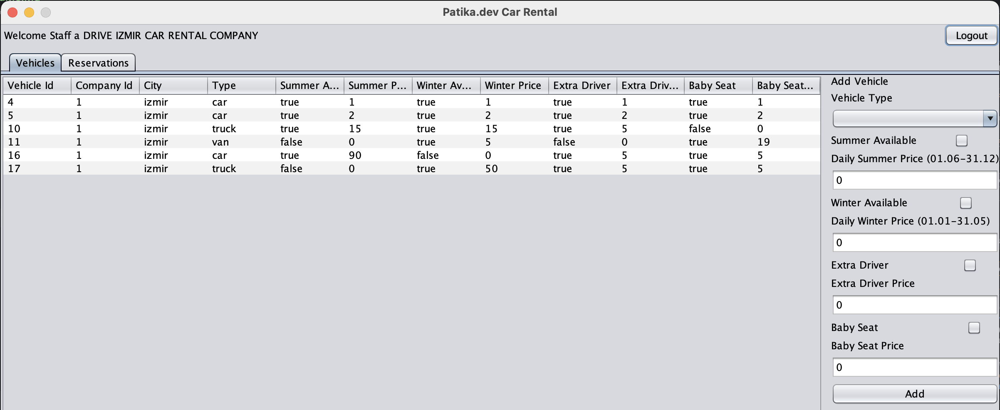
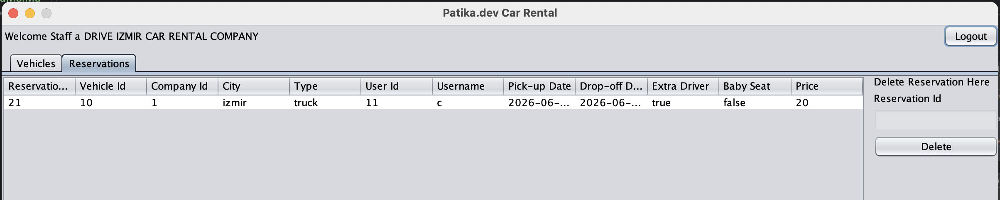
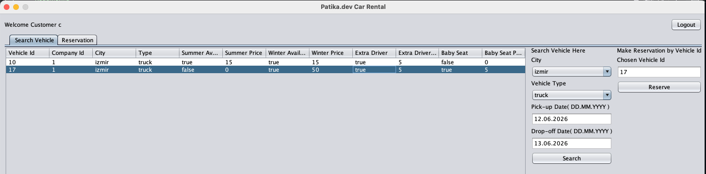
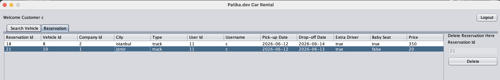
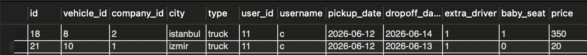

  

# Patika.dev Java Car Rental

## Description

### A simple Java desktop application for managing vehicle rentals and reservations. 

## The system allows:

- Staff to add vehicles, view and delete reservations

- Customers to browse vehicles, create and cancel reservations

- Automatic availability checks and reservation rules

- Data is stored in a MySQL database and automatically updated after each operation.

## Features

- Staff and customer login system

- Add vehicles, view, and cancel reservations (Staff)

- Search vehicles, make, view, and cancel reservations (Customer)

- Reservation cancellation limited to 1 day before pickup

- Menu-driven GUI using Java Swing
 (Main Menu → Login/Sign-Up → Customer/Staff Menu)

- MVC-based architecture for organized code

## Class Diagram
>>

## UML s

### Class UML

### Controller UML

### Helper UML

### Menu UML
### Controller Helper UML

>>

## Menus

### Login Menu

### Sign Up Menu

### Staff Menu
### Vehicle Panel

### Reservation  Panel

### Customer Menu
### Vehicle Panel

### Reservation  Panel

### DataBase Tables

### User Table

### Company Table

### Vehicle Table

### Reservation Table

## License

This project is free to use, modify, and distribute.  
Citation is appreciated but not required.

## Getting Started
### Prerequisites

- Java 17+ installed

- IntelliJ IDEA or other Java IDE

### Running the Project

Clone the repository:

- git clone <https://github.com/ayhan-unlu/CarRental>

- Open the project in IntelliJ IDEA

- Run the Main class

- Follow login panel to sign up and login,

Test Accounts
- Username	Password	Role
-     a	    a	 Staff at Drive İzmir
-     b	    b	 Staff at Auto İstanbul
-     c	    c	 Customer

File Storage

- All user data is stored in MySQL database and automatically updated after every transaction.

## Project Structure

_250926_CarRental

    Controller
        CompanyController.java
        ReservationController.java
        UserController.java
        VehicleController.java
        GUIController.java

    Helper
        Config.java
        DBConnector.java
        DBHelper.java
        GUIHelper.java
        MessageHelper.java
        SQLHelper.java

    Model
        Company.java
        Reservation.java
        User.java
        Vehicle.java

    View
        CustomerGUI/CustomerGUI.java
        LoginGUI/LoginGUI.java
        SignUpGUI/SignUpGUI.java
        StaffGUI/StaffGUI.java│

    Main.java

## Future Improvements

- Add more edit option

- Add reservation history

- Improve GUI interface